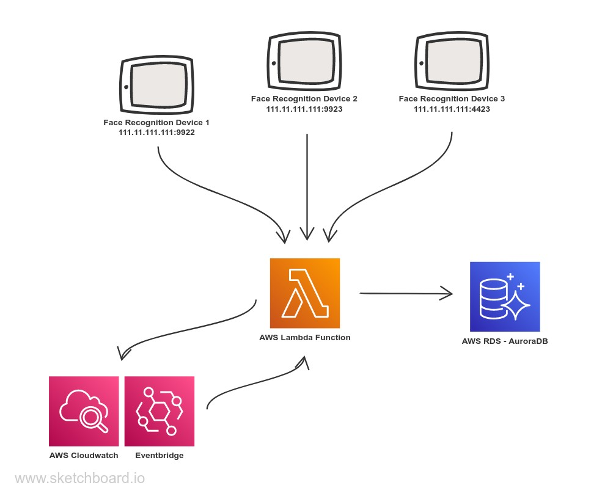

# aws-lambda-faceid
A sample serverless app that connects and get date from the face recognition devices to a serverless database.

### Tech Stack
Here are the list of packages/tech used in this project.
- C#
- AWS Toolkit
- AWS Lambda
- AWS Eventbridge (Cloudwatch Events)
- AWS Aurora (RDS)
- Face ID SDK
